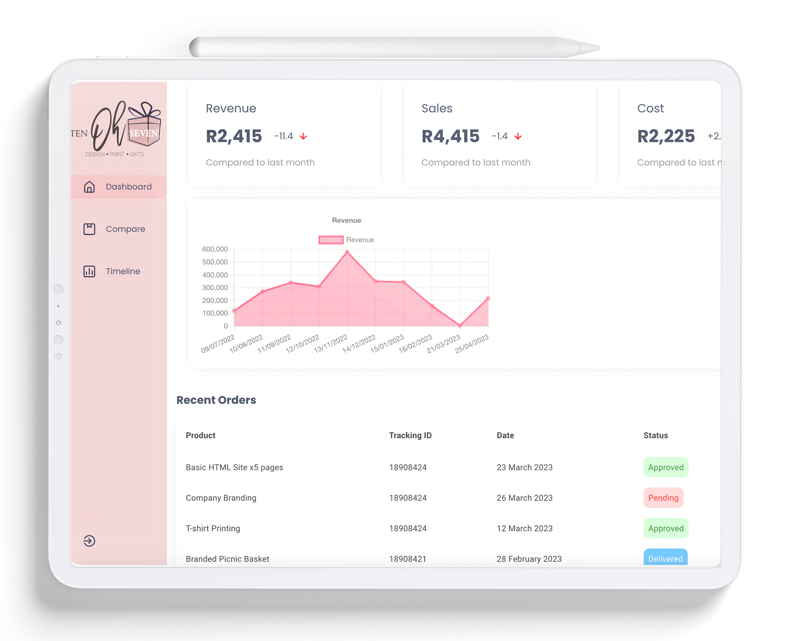
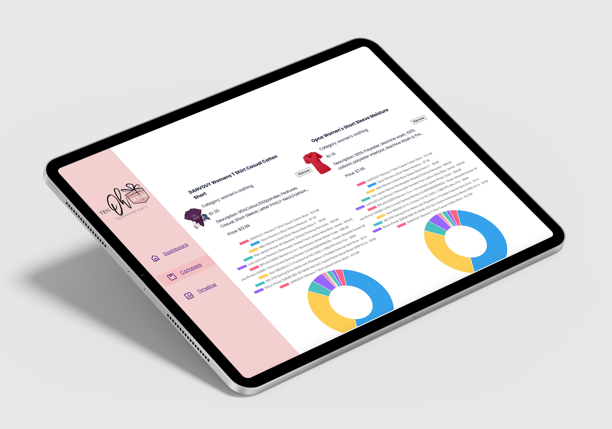
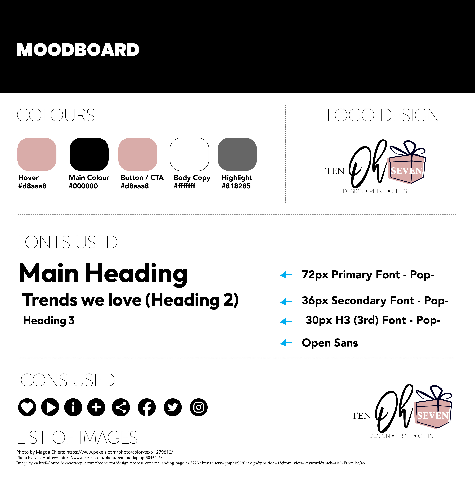

# Interactive Development 200 Term 1 Component Based Development -  Tebogo Ramolobeng

## About the project:

I embarked on a journey to learn Component-Based Development and advanced JavaScript concepts. This project focuses on creating a data-driven web application with data visualization using Charts.js. It's about understanding Component-Based Development, utilizing JavaScript, Axios for APIs, and React..  

## Getting Started:

### Prerequisites:

* [Git](https://git-scm.com/downloads)
* [Node.js](https://nodejs.org/en)
* [NPM](https://www.npmjs.com/)

### How to install:

* React Bootstrap   `npm install react-bootstrap bootstrap`
* React Router DOM   `npm i react-router-dom`
* Axios   `npm i axios`

### Install Dependencies: 
* npm i @iconscout/react-unicons
* npm i @mui/material
* npm i chart.js
* npm i framer-motion
* npm i react-dropdown
* npm i @babel/core

## Features and Functionality:

In this term, we're delving into advanced web development concepts, including Component-Based Development, utilizing APIs, React, and Charts.js for data-driven applications. The focus is on selecting complex datasets and creating unique visualizations. Essential requirements include React Routing, Axios for asynchronous data loading, a component-based UI, and a suitable API or dataset.

## Concept Process:

### Ideation:

I am thrilled to introduce the centerpiece of our data-driven web application – a robust dashboard designed to offer users a comprehensive insight into our selected API data. This pivotal component leverages the power of React and integrates vital visualizations through Charts.js, ensuring it equips businesses with invaluable insights into sales, stock comparisons, and order statuses.

This dashboard is crafted to empower business professionals with essential data insights. Users can effortlessly access sales data, compare stock levels, and pinpoint the most profitable items. Additionally, it provides a snapshot of recent orders, completed transactions, and processed orders.

### User Wireframes:

## Project Overview

The main theme of this term's project was the research, analysis, implementation, and visualization of a data set (API) of my choice. It was essential to select a sufficiently complex data set for my application. To visualize the data set, I utilized Charts.js, an open-source data visualization framework. I also implemented my unique form of data visualization, which was thematically related to the chosen data set. Additionally, I explored the concept of component-based development by using the React framework to construct the front end.

## Project Specifications
#### 1. Landing Page
The Landing Page comprises three core components: FeaturedProducts, LineChart, and Table, providing users with a consolidated view of the data.

FeaturedProducts Component: This component highlights essential data entries, delivering valuable insights into popular products, top-selling items, and significant metrics.

LineChart Component: Utilizing Chart.js and Axios, the LineChart presents an interactive line graph. Users can visualize revenue trends over time, identifying patterns and fluctuations for data-driven decision-making.

Table Component: Implementing MUI components, the Table offers a detailed list of recent purchases. It includes product names, tracking IDs, dates, and order statuses color-coded for swift analysis.

Asynchronous data retrieval is employed for a responsive user interface. The LineChart component utilizes the useEffect hook for asynchronous data fetching. To ensure a smooth and responsive user interface, the setTimeout function introduces a 1000-millisecond delay before updating the chartData state.

#### 1.1 Unique UI Visualization
On the landing page, I included a UI element of my design that thematically matched and outlined a specific aspect of my dataset.

#### 2. Comparison Page
The Compare page utilizes asynchronous attributes, specifically the Axios library, for making asynchronous requests to fetch data from the API. Through the useEffect hook, the page asynchronously fetches data, while the handleLoadItems function loads additional items for comparison. This approach ensures the code to continue executing while waiting for the data to be fetched. Users can select and compare two products from the API, and it displays essential details, including title, category, ID, description, price, sales, and stock.

A Doughnut chart showcases the price differences between the selected products, enabling users to make informed decisions based on a comprehensive analysis. Overall, the page is a dynamic and data-rich tool for users to compare products effectively.

#### 3. Timeline Page
I’ve integrated the Chart.js library’s LineChart component using React and the react-chartjs-2 package for smooth data visualization. Utilizing Axios, to fetch data from the API to create an interactive line graph displaying sales performance for the top 10 products. The tool also includes price difference details to help users identify pricing trends, providing a user-friendly and data-rich experience that empowers business users to monitor product performance effectively.

## Implementation
In my project, I chose [mention the name of the API or data set you selected] as my data source. I researched this data set extensively to understand its structure and content. I then implemented the following components based on the project requirements:

### Landing Page
I created a landing page that displayed a dashboard-style interface. It provided a summary of the chosen data set, including key statistics and trends. I also implemented a unique UI visualization element that highlighted a specific aspect of the data set, providing users with a quick and engaging overview.

### Comparison Page
For the comparison page, I designed a dedicated section where users could compare two objects from the data set. I used Bar graphs, Pie charts, and a Polar Area or Radar chart to present the comparative properties of the selected objects. This allowed users to gain valuable insights into the data.

### Challenges

Pulling data from an external API and presenting it in a user-friendly format posed significant challenges. The API I selected lacked sufficient data, including price difference information, which made it challenging to create comprehensive visualizations and meaningful comparisons.

## Future Implementation

To enhance my skills and become more industry-ready, I plan to focus on gaining a deeper understanding of React and JavaScript. This will enable me to tackle similar projects with more confidence and efficiency.

## Final Outcome

### Mockup Video

https://github.com/MareliLourens/OpenFlow/assets/109971278/8f61f450-b44c-4f12-83a9-c5c9435bf0a6

## Conclusion
This term's project was a significant learning experience. I successfully implemented a data-driven web application using Component-Based Development with React and data visualization with Charts.js. I honed my skills in JavaScript, data processing, and web development, and I now have a deeper understanding of data-driven applications. This project has prepared me for more advanced web development challenges in the future, and I look forward to applying the knowledge and skills I've gained in my upcoming projects.

#### List of Sources
Music by Joystock - https://www.joystock.org

